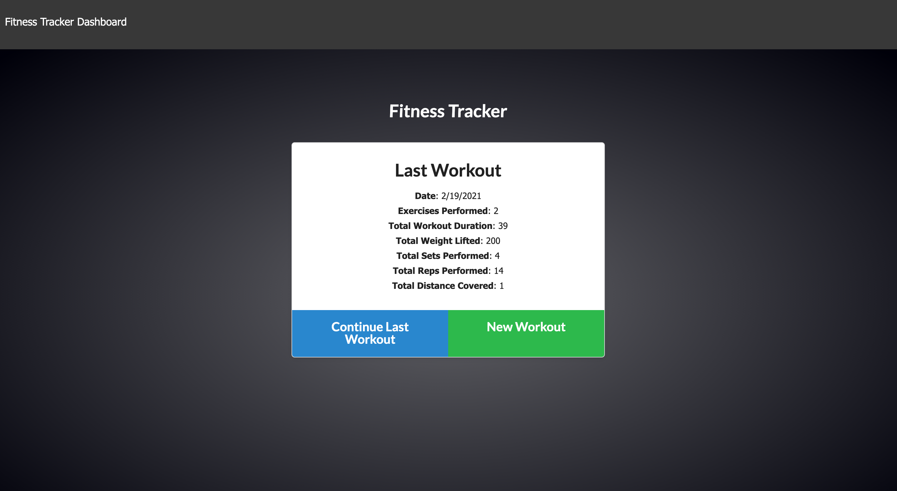
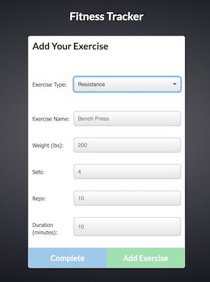

# My personal Fitness Tracker 

## Table Of Contents

1. [License](#license)

2. [Description](#description)

3. [Installation](#installation)

4. [Usage](#usage)

5. [Contribution](#Contribution)

6. [Questions](#questions)

## Description

Deployed link: [https://fitness-tracker96.herokuapp.com/](https://fitness-tracker96.herokuapp.com/)

This app is amazing.

## Installation

Easy

## Usage

Easy

## Contribution

contact me

## Questions

My GitHub profile: [https://github.com/paveldarii](https://github.com/paveldarii).

My email address: paveldarii@yahoo.com

## License

[The MIT License](https://opensource.org/licenses/MIT/)
