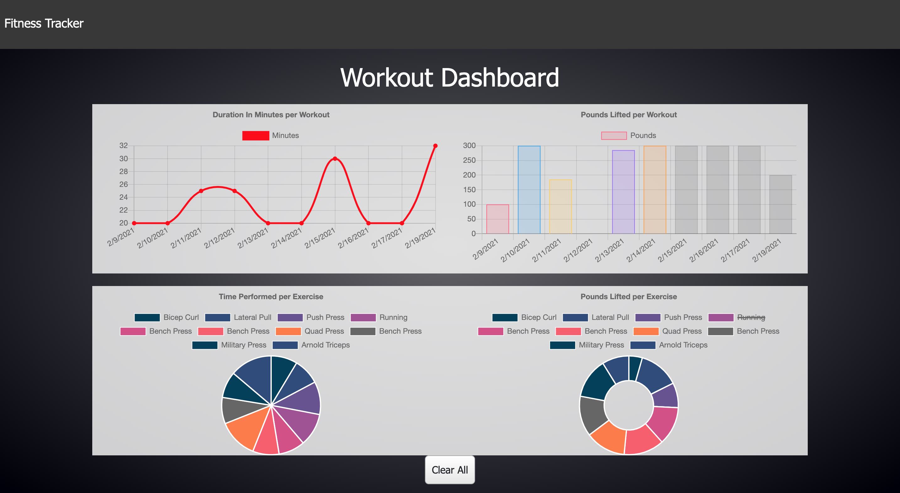

# My personal Fitness Tracker [](https://opensource.org/licenses/MIT)

## Table Of Contents

1. [License](#license)

2. [Description](#description)

3. [Installation](#installation)

4. [Usage](#usage)

5. [Contribution](#Contribution)

6. [Questions](#questions)

## Description

Technologies used: Nodejs, HTML, CSS, Bootstrap, Express, MongoDB & Mongoose, MongoDb Atlas, Heroku

Deployed link: [https://fitness-tracker96.herokuapp.com/](https://fitness-tracker96.herokuapp.com/)

Fitness Tracker is an app that will help you keep track of your exercises duration, weight lifted, amount of sets performed, the day when the exercise was performed, and finally user can have visual representation of their workout statistics.

## Installation

Next will be presented the steps you need to perform in order to install the project:

1. Clone the repo. In your CLI enter next command:

```bash
    git clone git@github.com:paveldarii/my-personal-fitness-tracker.git
```

2. Install all node libraries. In your CLI go to the home path of the app; then, enter next command:

```bash
    npm i
```

3. Create a database with MongoDB. In you CLI, access your Mongo database, then; enter the next commands in the order: Note(The way you can access your mongo database on your computer might be different as presented bellow, so contact me if you need support. However, if you are in your MongoDB; then, last two commands should work fine.)

```bash
    mongo
```

```bash
    use fitness_DB
```

```bash
    exit
```

4. Start the server. If you completed successfully all previous steps then you should be good to go.

```bash
   node server.js
```

or

```bash
   npm start
```

Optional: to add some seeds in your database, enter in your CLI:

```bash
   npm run seed
```

## Usage

Home page displays the last workout statistics, and it might include multiple exercises, the sum of the all weight lifter or sum of all the duration of the exercise.  


On add exercise page you will create a new workout or you will continue the last one respectively with what you have chosen on home page. Then, you will chose if the type of exercise is cardio or resistance; next, you will need to add respective data. Lastly, you can push add button, so you will stay on the same page or complete button which will return you to the home page.  


To get visual representation of all your fitness data, just press Dashboard in navigation bar. To clear everything on the screen just push "Clear All" on the bottom of the page.  


## Contribution

I will be glad to see your interest in this project, so if you want to contribute, just contact me on the email posted in [Questions](#questions) bellow; then, we can start to collaborate. Thank you.

## Questions

My GitHub profile: [https://github.com/paveldarii](https://github.com/paveldarii).

My email address: paveldarii@yahoo.com

## License

[The MIT License](https://opensource.org/licenses/MIT/)
